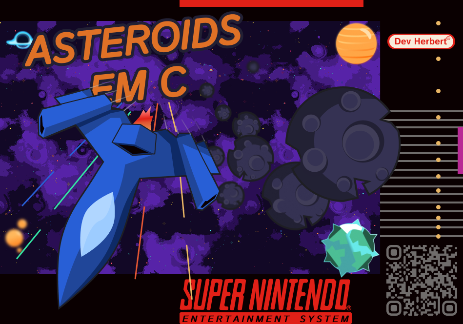
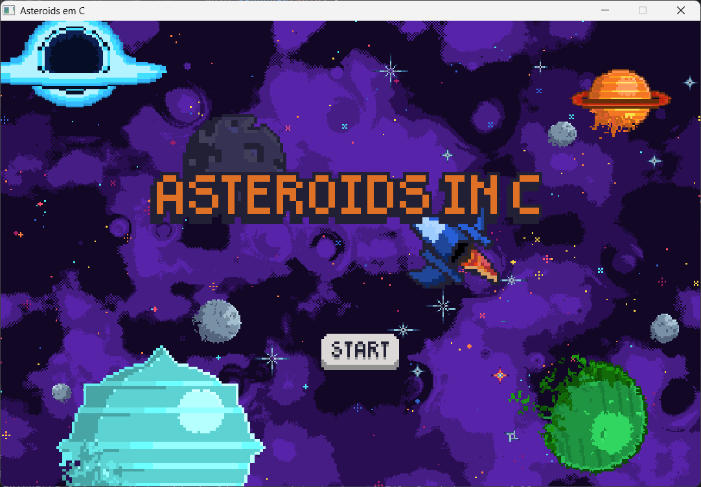
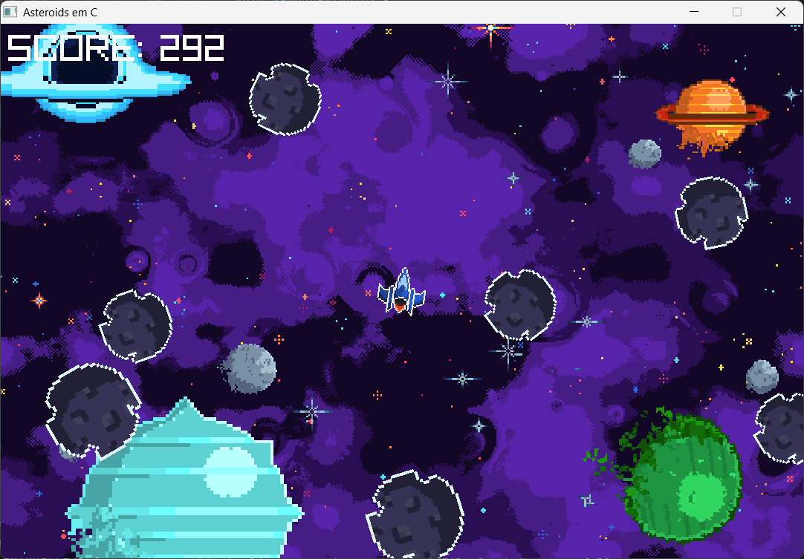
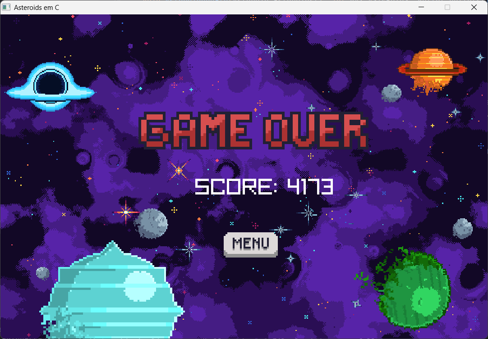

# 🛸 Asteroids em C

**Asteroids em C** é um jogo 2D simples desenvolvido com a biblioteca Raylib, inspirado no clássico Asteroids e com um estilo visual reminiscentes dos jogos do Super Nintendo.

>Capa do jogo
> 
>

## 🎮 Gameplay

- Controle sua nave usando as teclas **W, A, S, D**.
- Atire com o **botão esquerdo do mouse** para destruir os asteroides.
- Cada asteroide destruído concede pontos ao jogador.
- Os asteroides surgem como obstáculos e se movem em direção ao jogador.

## 🛠️ Tecnologias Utilizadas

- **Linguagem:** C
- **Biblioteca Gráfica:** Raylib
- **Estilo visual:** Inspirado nos jogos do Super Nintendo
- **Build System:** CMake

## 🚀 Como Jogar

Você precisa compilar o jogo usando o cmake para seu sistema operacional.

### 🔧 Compilando e Executando

1. Clone o repositório:
   ```bash
   git clone https://github.com/seuusuario/asteroids-c.git
   cd asteroids-c
   ```
2. Instale a Raylib (caso ainda não tenha):
    - Linux (Ubuntu/Debian):
      ```bash
      sudo apt install libraylib-dev
      ```
    - Windows (via MSYS2):
      ```bash
      pacman -S mingw-w64-x86_64-raylib
      ```
    - Ou baixe manualmente do [site oficial](https://www.raylib.com/)

3. Compile o jogo usando CMake:
   ```bash
   mkdir build && cd build
   cmake ..
   make
   ```
4. Execute:
   ```bash
   ./asteroids
   ```

## 📷 Screenshots

Menu Inicial



Gameplay



GameOver




## 🎥 Gameplay Gif


